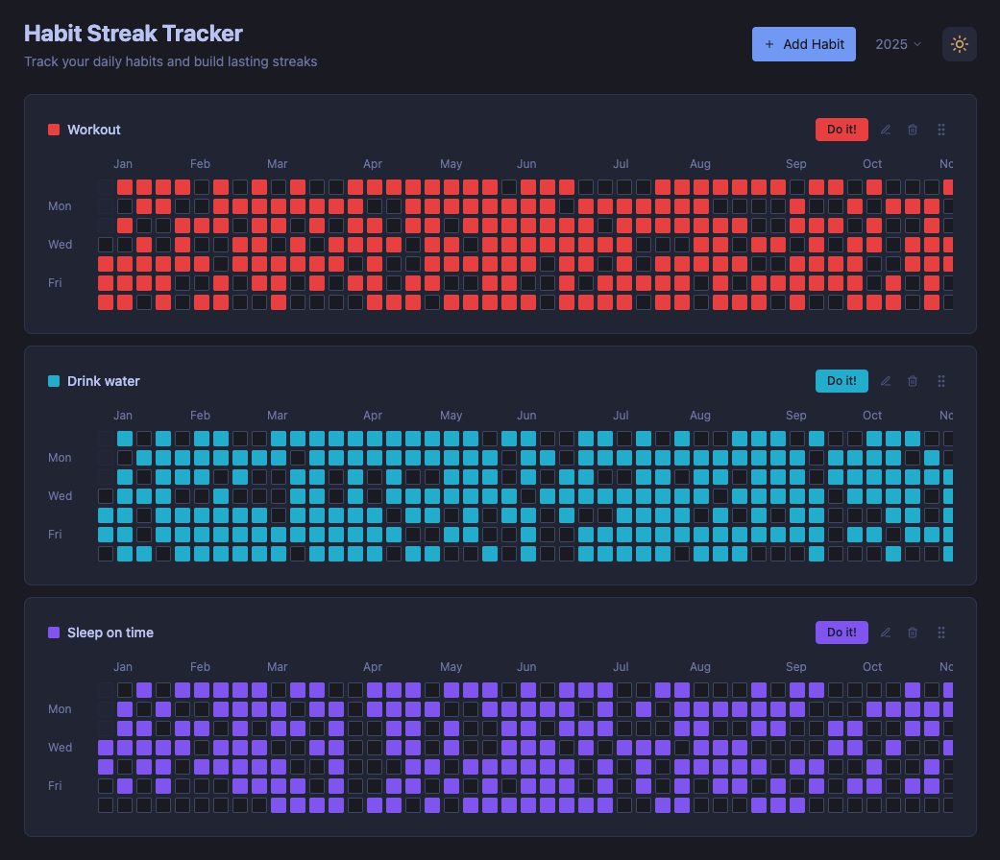

# Habit Streak Tracker

A GitHub contributions-style habit tracking web application built with React, TypeScript, and Tailwind CSS.



## TODO:
- [ ] Database for persistent storage
- [ ] SSO authentication

## Features

- 📈 **Visual Progress Tracking**: GitHub-style contribution grid showing your daily habit completions
- 🌙 **Dark Mode Support**: Toggle between light and dark themes with system preference detection
- 💾 **Local Storage**: All data persisted locally in your browser
- 🎨 **Customizable Colors**: Choose from 8 different colors for each habit
- 📱 **Responsive Design**: Works on desktop and mobile devices
- ⚡ **Fast & Lightweight**: Built with Vite for optimal performance

## Getting Started

1. Install dependencies:
   ```bash
   npm install
   ```

2. Start the development server:
   ```bash
   npm run dev
   ```

3. Open [http://localhost:5173](http://localhost:5173) in your browser

## Usage

1. Click "Add Habit" to create a new habit
2. Enter a habit name and choose a color
3. Click "Mark Done" to complete the habit for today
4. View your progress in the contribution grid
5. Use the dark mode toggle in the top right corner

## Available Scripts

- `npm run dev` - Start development server
- `npm run build` - Build for production
- `npm run preview` - Preview production build
- `npm run lint` - Run ESLint
- `npm run typecheck` - Check TypeScript types

## Technologies Used

- **React 18** with TypeScript
- **Vite** for fast development and building
- **Tailwind CSS** for styling
- **Lucide React** for icons
- **Local Storage** for data persistence
